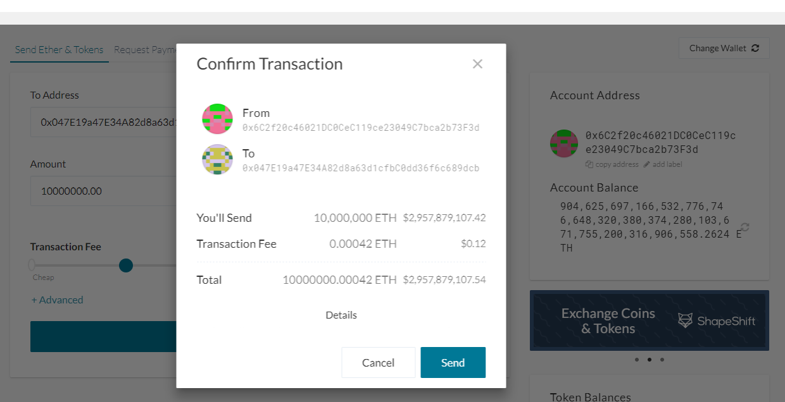

# Blockchain Custom Network: PetrolCol
This activity demonstrates how to start the Petrolcol network, a custom testnet blockchain created using clique proof of authority consensus algorithm. This file also demonstrates how to send a successful transaction from node1 to node2 as well as mining in the network. See steps below:

## How to start the network:
1. First, we must run each node also known as wallets using geth. This is done by running each geth command below in separate git bash command prompts.

  > **_$./geth --datadir node1/ --syncmode 'full' --networkid <any_numbers> --rpc --minerthreads 1 --unlock "node1_sealer_address" --password node1/password.txt --mine --allow-insecure-unlock_**

  > **_$./geth --datadir node2/ --syncmode 'full' --networkid <any_numbers> --unlock "node2_sealer_address" --password node2/password.txt --mine --allow-insecure-unlock --port 30304 --bootnodes "<enode_address_from_node1>" --ipcdisable_**
  
  
  The **--** are flags that indicate different requests when launching the nodes
  * --datadir: is the data directory that indicates which node will be used.
  * --syncmode: uses "fast", "full", or "light" which if set to "full" helps prevent the error "Discarded Bad Propagated Block."
  * --rpc: enables the HTTP-RPC server
  * --networkid: is the network id defined in the petrolcol.json file. Although this can be set to any number, it is advisable ot use the same Network ID sepcified in the petrolcol.json file. In other words, use the same number as the chain ID in order to prevent invalid transaction errors from having separate network and chain ID. In this case the chain ID is 123.
  * --minerthreads: specifies the number of CPU threads to use for mining.
  * --unlock --password --mine: tells the node to use the password in the txt file and begin to mine.
  * --allow-insecure-network: this allows insecure account to unlock when RPCs are exposed by HTTP. Prevents the HTTP error when added.
  * --port: this sets the port for the node to run. If node1 is running in port 30303 then node2 must be set to 30304. Both nodes cannot run in the same port.
  * --ipcdisable: disables the IPC_RPC server. It is used for windows if left out can raise errors due to server interferene.
  * --bootnodes: it is set using the enode address from node1 mining terminal so that node2 can a make connection with that node. The enode address is comma separated enode URL for p2p discovery bootstrap. To find it simply look for it after running node 1. It should be displayed under self= as shown in the image below:
  
  
Once both nodes are running, the nodes Should display messages like the ones in the image below indicating that they are looking for peers and or mining on the network. If done correctly the nodes will communicate and are ready to validate transactions.

## Making a Transaction on the Petrocol Network:
 2. Once both nodes are running and communicating, open the MyCrypto program.
 3. Change the network using the "change Network" link on the bottom left hand side. When prompted for a network, select the "Add Custom Node" option. It is the last one on the list.\
 
   
 4. Select **+Add Custom Node**\
 
   
 5. set the Netowrk to "Custom," Node Name to your choosing, Network Name to "Petrocol", Currency to ETH, and Chain ID to 123. Lastly, use the https://127.0.0.1:8545 for the URL, so that it is directed to the RPC port on the local machine.\
  
 
 6. Once this has been set, select the Keystore file option. In the **Select Wallet File** input field insert the UTC file which is located inside the node1 folder.
 
 
 Now, a transaction can be sent between two nodes. 

 7. Copy the pre-fund address into the **To Address** field. This address is the same as the public address from node2. It is what will allow transactions to be set to the specified node. Input the desired amount and hit **Send Transaction**.
  
  
 8. Confirm the transaction by clicking **Send**.
 
 
 9. Once the transaction is over, a green ribbon message will appear with access to the transaction status. Click **Check TX Status** to view transaction status. 
 
 
 10. Once the transaction has been validated, the status of the transaction receipt (or Block) should appear as successful.
 
 
 
